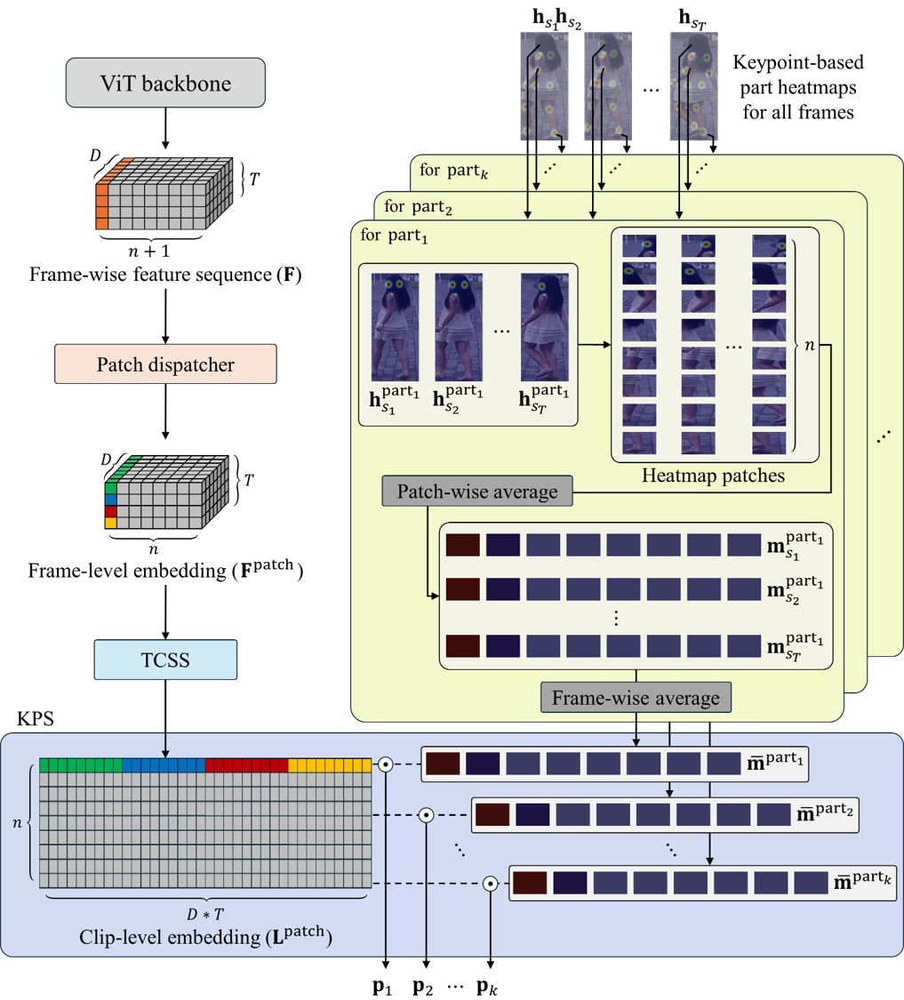
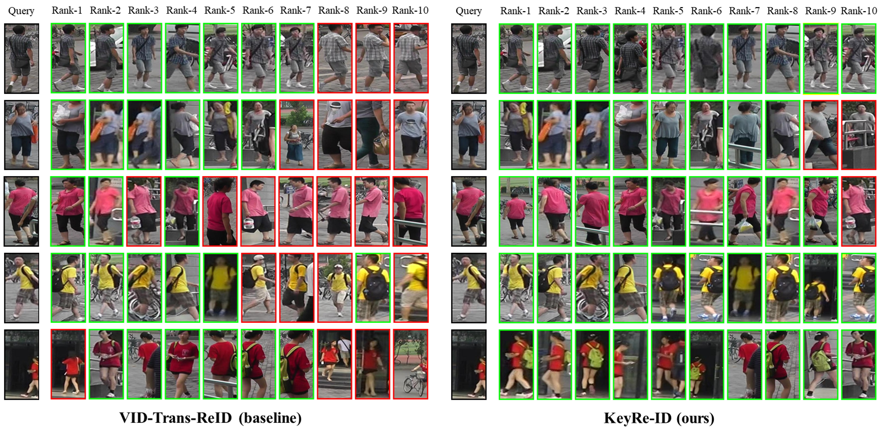

# KeyRe-ID

**KeyRe-ID** is a keypoint-guided Transformer for video-based person re-identification. A ViT-B/16 backbone is augmented with two complementary modules:

- **KPS** (Keypoint-guided Part Segmentation) turns pose heatmaps into six body-part weights that steer the local branch.
- **TCSS** (Temporal Clip Shift & Shuffle) perturbs patch tokens across frames to improve temporal robustness.

Together they deliver competitive accuracy on MARS, iLIDS-VID, DukeMTMC-VideoReID, and PRID-2011.

> This is the `dev` branch, which holds the consolidated code for the Pattern Recognition journal revision.
> The original release lives on `main`.

<p align="center">
  
</p>

---

## Architecture

KeyRe-ID is composed of four core modules:

- **ViT Backbone** — extracts patch and [CLS] tokens from each frame.
- **Global Branch** — aggregates [CLS] tokens across frames via temporal attention to form a clip-level identity feature.
- **Local Branch** — uses pose keypoints to generate part-specific heatmaps and routes them through the KPS module for part-level attention.
- **Temporal Clip Shift and Shuffle (TCSS)** — perturbs patch token order across frames to improve robustness under motion and temporal misalignment.

### KPS Visualization

<p align="center">
  
</p>

The KPS module turns keypoint-derived heatmaps into patch-level part importance vectors, which modulate patch token attention per body part and enable fine-grained part-aware representation learning.

---

## 🔎 Retrieval Comparison (Ranking List)

<p align="center">
  
</p>

**Left**: Top-10 retrieval results from **VID-Trans-ReID**
**Right**: Top-10 retrieval results from **KeyRe-ID (Ours)**
🟩 Green boxes indicate correct identity matches
🟥 Red boxes indicate incorrect matches

Under pose variation, viewpoint change, and occlusion, KeyRe-ID retrieves more accurate identity matches than VID-Trans-ReID.

---

## 🏆 Performance

Results across four video-based Re-ID benchmarks (mean ± std over multiple seeds / splits).

| Dataset              |  Rank-1 (%)  |  Rank-5 (%)  |   mAP (%)    |
|----------------------|:------------:|:------------:|:------------:|
| MARS                 |  97.4 ± 0.1  |      —       |  91.2 ± 0.8  |
| iLIDS-VID            |  93.3 ± 0.5  |  99.9 ± 0.0  |      —       |
| DukeMTMC-VideoReID   |  99.9 ± 0.0  |      —       |  95.9 ± 0.6  |
| PRID-2011            |  97.4 ± 0.7  |      —       |      —       |

---

## 🏁 Getting Started

Download the ImageNet pretrained Transformer backbone:
- [ViT-B/16 ImageNet-21K](https://huggingface.co/google/vit-base-patch16-224)

Download the video person Re-ID datasets:
- [MARS](http://www.liangzheng.com.cn/Project/project_mars.html)
- [iLIDS-VID](https://xiatian-zhu.github.io/downloads_qmul_iLIDS-VID_ReID_dataset.html)
- [DukeMTMC-VideoReID](https://github.com/Yu-Wu/DukeMTMC-VideoReID)
- [PRID-2011](https://www.tugraz.at/institute/icg/research/team-bischof/learning-recognition-surveillance/downloads/prid11/)

---

## ⚙️ Installation

```bash
git clone -b dev https://github.com/JinSeong0115/KeyRe-ID.git
cd KeyRe-ID

conda create -n keyreid python=3.9 -y
conda activate keyreid

pip install torch torchvision --index-url https://download.pytorch.org/whl/cu118
pip install -r requirements.txt
```

For pose preprocessing, install [OpenPifPaf](https://github.com/openpifpaf/openpifpaf):

```bash
pip install openpifpaf
```

---

## 🚀 Usage

### Pose & heatmap preprocessing

Run once per dataset:

```bash
python keypoint/extract_keypoint.py --dataset MARS --data_root ./data
python keypoint/keypoint_to_mask.py  --dataset MARS --data_root ./data
```

### Training

```bash
python train.py --dataset MARS     --dataset_root ./data/MARS
python train.py --dataset iLIDSVID --dataset_root ./data/iLIDSVID
python train.py --dataset Duke     --dataset_root ./data/DukeMTMC-VideoReID
```

### Evaluation

```bash
python test.py       --dataset MARS --weights ./weights/MARSbest_CMC.pth
python eval_rank5.py --dataset MARS --weights ./weights/MARSbest_CMC.pth
```

---

## ✨ Key Features

✔️ Dual-branch framework combining a global [CLS] identity stream with part-aware local features
✔️ Keypoint-guided Part Segmentation (KPS) for anatomically meaningful soft attention
✔️ Temporal Clip Shift and Shuffle (TCSS) for motion and misalignment robustness
✔️ ViT-B/16 backbone with transformer-based temporal aggregation
✔️ Supports four video Re-ID benchmarks (MARS / iLIDS-VID / DukeMTMC-VideoReID / PRID-2011)

---

## 📁 Repository Layout

```
KeyRe-ID/
├── train.py, test.py, eval_rank5.py   # main entry points
├── keyreid.py                         # KeyRe-ID model (global + local branches)
├── vit_backbone.py                    # ViT-B/16 backbone
├── losses.py, loss/                   # combined loss + per-loss modules
├── dataloader.py, heatmap_loader.py   # data / heatmap loaders
├── datasets/                          # MARS / iLIDS-VID / Duke / PRID
├── keypoint/                          # OpenPifPaf pipeline
├── visualization/                     # attention / ranking visualization
├── utils.py, evaluation.py            # utilities
├── experiments/                       # paper-specific experiments
├── scripts/                           # reproducibility shell scripts
└── docs/                              # design notes
```

---

## 🙏 Acknowledgement

Thanks to AishahAADU — parts of the implementation are adapted from [AishahAADU/VID-Trans-ReID](https://github.com/AishahAADU/VID-Trans-ReID).

## 📄 Citation

If you find this work useful, please cite:

**[KeyRe-ID: Keypoint-Guided Person Re-Identification using Part-Aware Representation in Videos](https://arxiv.org/abs/2507.07393)**
ArXiv preprint, 2025.

```bibtex
@article{kim2025keyreid,
  title        = {KeyRe-ID: Keypoint-Guided Person Re-Identification using Part-Aware Representation in Videos},
  author       = {Jinseong Kim and Jeonghoon Song and Gyeongseon Baek and Byeongjoon Noh},
  journal      = {arXiv preprint arXiv:2507.07393},
  year         = {2025},
  url          = {https://arxiv.org/abs/2507.07393},
  eprint       = {2507.07393},
  archivePrefix= {arXiv}
}
```

## License

Released under the [MIT License](LICENSE).
