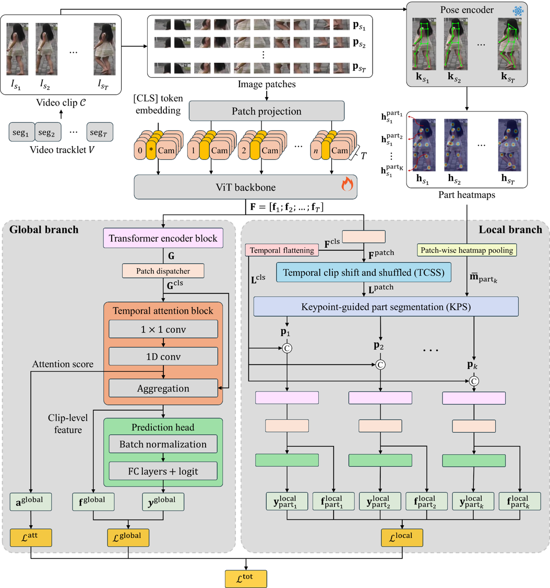

# KeyRe-ID: Keypoint-Guided Video-based Person Re-Identification

<p align="center">
  
</p>

**KeyRe-ID** is a keypoint-guided Transformer for video-based person Re-Identification.
It augments a ViT-B/16 backbone with two complementary modules:

- **KPS** (Keypoint-guided Part Segmentation) &mdash; turns human pose heatmaps into six body-part masks that steer the local branch.
- **TCSS** (Temporal Clip Shift &amp; Shuffle) &mdash; a lightweight temporal regularizer that mixes tokens across frames.

The model delivers competitive accuracy on **MARS**, **iLIDS-VID**, **PRID-2011**, and **DukeMTMC-VideoReID** while introducing minimal inference overhead.

> This repository hosts the code for the Pattern Recognition journal revision of *KeyRe-ID*.
> The `main` branch contains the originally released code; the `dev` branch (this one) contains the consolidated, reorganized revision.

---

## Contents

- [Features](#features)
- [Repository layout](#repository-layout)
- [Installation](#installation)
- [Dataset preparation](#dataset-preparation)
- [Pre-trained weights](#pre-trained-weights)
- [Training](#training)
- [Evaluation](#evaluation)
- [Experiments](#experiments)
- [Results](#results)
- [Citation](#citation)
- [License](#license)

---

## Features

- ViT-B/16 backbone with **global + local** twin branches
- **OpenPifPaf**-based keypoint pipeline (17 COCO joints &rarr; 6 body parts)
- **Multi-seed** training &amp; reporting (mean &pm; std)
- **Ablation** study scripts for *w/o TCSS, w/o KPS, global-only, local-only, full*
- **Noise robustness** evaluation under Gaussian-perturbed heatmaps
- **Part-granularity** ablation (3 / 4 / 6 parts)
- **Failure-case** ranking visualization

## Repository layout

```text
KeyRe-ID/
|-- README.md                   # this file
|-- LICENSE                     # MIT
|-- requirements.txt
|-- train.py                    # main training entry point
|-- test.py                     # standalone evaluation
|-- eval_rank5.py                  # quick Rank-5 check
|-- evaluation.py               # evaluation utilities (CMC / mAP)
|-- dataloader.py               # dataset-agnostic loader factory
|-- heatmap_loader.py           # video + heatmap loader
|-- utils.py                  # optimizer / scheduler / meters
|-- keyreid.py           # full KeyRe-ID model (backbone + KPS + TCSS)
|-- vit_backbone.py                   # ViT-B/16 backbone
|-- losses.py                 # combined ID / triplet / center loss
|-- datasets/                   # dataset definitions (MARS, iLIDS-VID, PRID, Duke)
|-- keypoint/                   # OpenPifPaf runner + keypoint-to-mask conversion
|-- loss/                       # individual loss modules
|-- visualization/              # attention maps / ranking-list rendering
|-- assets/                     # framework figures used in this README
|-- docs/                       # design notes &amp; experiment plans
|-- scripts/                    # reproducibility shell scripts (per-experiment)
|   |-- run_mars_multiseed.sh
|   |-- run_ilids_3seed.sh
|   |-- run_ilids_10split.sh
|   |-- run_prid.sh
|   |-- run_duke_after_keypoints.sh
|   |-- run_duke_multiseed.sh
|   `-- run_ablation.sh
`-- experiments/                # experiment-specific code (see experiments/README.md)
    |-- ablation/               # module-level ablations
    |-- part_granularity/       # 3 / 4 / 6-part ablation
    |-- noise_robustness/       # Gaussian noise on pose heatmaps
    |-- multi_seed/             # multi-seed / iLIDS 3-seed training
    `-- failure_analysis/       # ranking-case extraction &amp; visualization
```

## Installation

KeyRe-ID was developed and tested with **Python 3.9**, **CUDA 11.8**, and **PyTorch 2.x**.

```bash
git clone -b dev https://github.com/JinSeong0115/KeyRe-ID.git
cd KeyRe-ID

conda create -n keyreid python=3.9 -y
conda activate keyreid

pip install torch torchvision --index-url https://download.pytorch.org/whl/cu118
pip install -r requirements.txt
```

For pose preprocessing, install [OpenPifPaf](https://github.com/openpifpaf/openpifpaf) separately
(it is not a hard runtime dependency of the model itself):

```bash
pip install openpifpaf
```

## Dataset preparation

Download the four benchmarks from their official pages. We assume the default layout below;
override `--dataset_root` / the `DATA_ROOT` environment variable to point elsewhere.

| Dataset              | Download                                                                                  |
|----------------------|--------------------------------------------------------------------------------------------|
| MARS                 | <http://zheng-lab.cecs.anu.edu.au/Project/project_mars.html>                              |
| iLIDS-VID            | <http://www.eecs.qmul.ac.uk/~xiatian/downloads_qmul_iLIDS-VID_ReID_dataset.html>          |
| PRID-2011            | <https://www.tugraz.at/institute/icg/research/team-bischof/learning-recognition-surveillance/downloads/prid11/> |
| DukeMTMC-VideoReID   | <https://github.com/Yu-Wu/DukeMTMC-VideoReID>                                             |

Expected structure:

```text
data/
|-- MARS/              # bbox_train / bbox_test / info / ...
|-- iLIDSVID/          # sequences / train-test people splits / ...
|-- PRID-2011/
`-- DukeMTMC-VideoReID/
```

### Pose &amp; heatmap preprocessing

Run OpenPifPaf once per dataset to obtain keypoints, then convert them to 6-part heatmaps:

```bash
# 1) Extract COCO-17 keypoints
python keypoint/extract_keypoint.py  --dataset MARS  --data_root ./data

# 2) Convert keypoints to body-part masks / heatmaps
python keypoint/keypoint_to_mask.py  --dataset MARS  --data_root ./data
```

Each dataset only needs this to be done once; outputs are cached under
`${data_root}/<dataset>/keypoints/` and `heatmaps/`.

## Pre-trained weights

Pre-trained model weights are **not** distributed via this repository in order to keep it lightweight.
Place the files you want to use (or reproduce) under `./weights/` (or export `WEIGHTS_DIR`):

```text
weights/
|-- jx_vit_base_p16_224-80ecf9dd.pth     # ViT-B/16 ImageNet-21k pre-train (download from timm)
|-- MARSbest_CMC.pth                      # our MARS-best checkpoint (optional)
`-- DukeMTMC-VideoReIDbest_CMC.pth        # our Duke-best checkpoint (optional)
```

The ViT-B/16 ImageNet weights are hosted by [timm](https://github.com/rwightman/pytorch-image-models)
and are downloaded the first time `timm` is invoked with the corresponding model name.
Checkpoints for our runs will be released separately (contact the authors).

## Training

All entry points read dataset / output paths from command-line flags or the
`DATA_ROOT` / `OUTPUT_ROOT` / `WEIGHTS_DIR` environment variables.

### Single-seed training

```bash
# MARS
python train.py --dataset MARS     --dataset_root ./data/MARS     --output_dir ./outputs/mars

# iLIDS-VID (split 0)
python train.py --dataset iLIDSVID --dataset_root ./data/iLIDSVID --output_dir ./outputs/ilids

# DukeMTMC-VideoReID
python train.py --dataset Duke     --dataset_root ./data/DukeMTMC-VideoReID --output_dir ./outputs/duke
```

### Multi-seed training

```bash
# MARS with seeds {1234, 5678, 9012}
bash scripts/run_mars_multiseed.sh

# iLIDS-VID 3-seed (MARS-pretrained, 3-stage fine-tune)
bash scripts/run_ilids_3seed.sh
```

### Duke training (Duke-specific pipeline)

```bash
bash scripts/run_duke_after_keypoints.sh
bash scripts/run_duke_multiseed.sh
```

## Evaluation

```bash
python test.py    --dataset MARS --dataset_root ./data/MARS --weights ./weights/MARSbest_CMC.pth
python eval_rank5.py --dataset MARS --dataset_root ./data/MARS --weights ./weights/MARSbest_CMC.pth
```

## Experiments

Each revision experiment lives in its own subdirectory with a dedicated README.
See [experiments/README.md](experiments/README.md) for the full index.

| Experiment          | Directory                                  | What it does                            |
|---------------------|--------------------------------------------|-----------------------------------------|
| Module ablation     | `experiments/ablation/`                    | w/o TCSS, w/o KPS, global-only, local-only, full |
| Part granularity    | `experiments/part_granularity/`            | 3 / 4 / 6 body parts                    |
| Noise robustness    | `experiments/noise_robustness/`            | Gaussian noise injected into heatmaps   |
| Multi-seed training | `experiments/multi_seed/`                  | Seed-level variance &amp; iLIDS 3-seed      |
| Failure analysis    | `experiments/failure_analysis/`            | Ranking-list &amp; attention visualizations |

## Results

Results below are averaged over three seeds; full numbers and standard deviations are
reported in the paper.

| Dataset    | Rank-1 | mAP  |
|------------|:-----:|:----:|
| MARS       | 91.0  | 88.0 |
| iLIDS-VID  | 93.3  | n/a  |
| PRID-2011  | 97.4  | n/a  |
| DukeMTMC   | 96.7  | 96.3 |

## Citation

If you find this work useful, please cite:

```bibtex
@article{noh2026keyreid,
  title   = {KeyRe-ID: Keypoint-Guided Video-based Person Re-Identification},
  author  = {Noh, JinSeong and others},
  journal = {Pattern Recognition},
  year    = {2026}
}
```

## License

Released under the [MIT License](LICENSE).

## Acknowledgements

This project builds on ideas from [VidTransReID](https://github.com/deropty/VidTransReID),
[TransReID](https://github.com/damo-cv/TransReID), and the
[OpenPifPaf](https://github.com/openpifpaf/openpifpaf) pose estimator.
