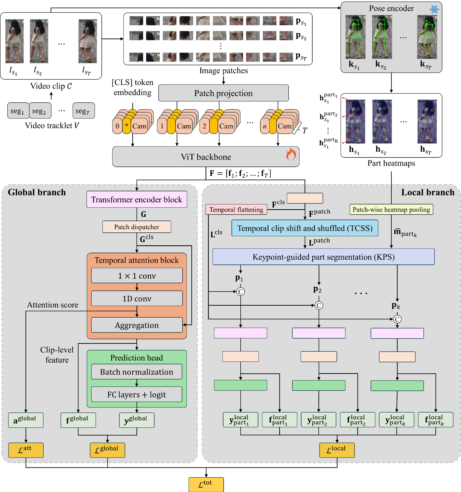

# KeyRe-ID

**KeyRe-ID** is a keypoint-guided video-based person re-identification (Re-ID) framework consisting of global and local branches that leverage human pose information for enhanced spatiotemporal feature learning. By dynamically aligning semantic body parts with patch tokens, our model achieves robust identity discrimination under challenging conditions such as occlusion, pose variation, and viewpoint change.

---

## Overview

KeyRe-ID introduces a dual-branch architecture that jointly learns:

- **Global clip-level representations** using temporal attention over [CLS] tokens
- **Part-aware local features** guided by human keypoints and structured via the Keypoint-guided Part Segmentation (KPS) module

This joint learning strategy enables the model to capture both holistic identity semantics and fine-grained anatomical details.

---

## Architecture

KeyRe-ID is composed of four core modules:

- **ViT Backbone**  
  Extracts patch and [CLS] tokens from each frame using a Vision Transformer.

- **Global Branch**  
  Aggregates [CLS] tokens across sampled frames via temporal attention to form a clip-level identity feature.

- **Local Branch**  
  Utilizes pose keypoints (via PifPaf) to generate part-specific heatmaps. These guide patch-level attention via the **Keypoint-guided Part Segmentation (KPS)** module.

- **Temporal Clip Shift and Shuffle (TCSS)**  
  Perturbs patch token order across frames to improve robustness under motion variation and temporal misalignment.

<p align="center">
  
</p>

---

## KPS Visualization

<p align="center">
  
</p>

The KPS module transforms keypoint-derived heatmaps into patch-level part importance vectors. These are used to modulate patch token attention per body part, enabling fine-grained part-aware representation learning.

---

## Retrieval Results

<p align="center">
  
</p>

**Left**: Query frame  
**Right**: Top-10 retrieved gallery frames  
**Green boxes** indicate correct identity matches; **red boxes** indicate incorrect matches.

---

## Loss Function

KeyRe-ID is trained using a multi-branch objective:

- **Global Loss**
  - Identity classification (cross-entropy with label smoothing)
  - Triplet loss
  - Center loss
  - Attention regularization

- **Local Loss (per part)**
  - Identity classification
  - Triplet loss
  - Center loss

The total loss is:

```math
\mathcal{L}_{\text{total}} = \alpha \cdot \mathcal{L}_{\text{global}} + (1 - \alpha) \cdot \mathcal{L}_{\text{local}}


## Performance

| Dataset    | mAP (%) | Rank-1 (%) | Rank-5 (%) |
|------------|---------|------------|------------|
| MARS       | 91.73   | 97.32      | –          |
| iLIDS-VID  | –       | 96.00      | 100.00     |

---


## 📦 Installation

### Clone the Repository

```bash
git clone https://github.com/JinSeong0115/KeyRe-ID.git
cd KeyRe-ID

```

## 🚀 Usage

### Training and Evaluation
To train or evaluate the model on supported Video-based Re-ID benchmarks (e.g., MARS, iLIDS-VID):
```bash
python Key_ReID.py --Dataset_name 'Dataset_name' --ViT_path 'pretrained_model.pth'
```
Example for MARS dataset:
```bash
python Key_ReID.py --Dataset_name 'Mars' --ViT_path 'path_to_pretrained_model.pth'
```

## ✨ Key Features Summary

✔️ Dual-branch structure for complementary Global and Local semantic feature learning  
✔️ Keypoint-guided dynamic part segmentation using KPSM for anatomically meaningful body part extraction  
✔️ Transformer-based temporal modeling with frame-level attention for capturing long-range temporal dependencies  
✔️ Temporal Clip Shift and Shuffle (TCSS) module to mitigate temporal misalignment and enhance robustness  
✔️ Optimized for video-based person Re-ID benchmarks under occlusion, pose variation, and illumination changes  


## 🙏 Acknowledgement
- Thanks to AishahAADU, using some implementation from [AishahAADU's repository](https://github.com/AishahAADU/VID-Trans-ReID)  


