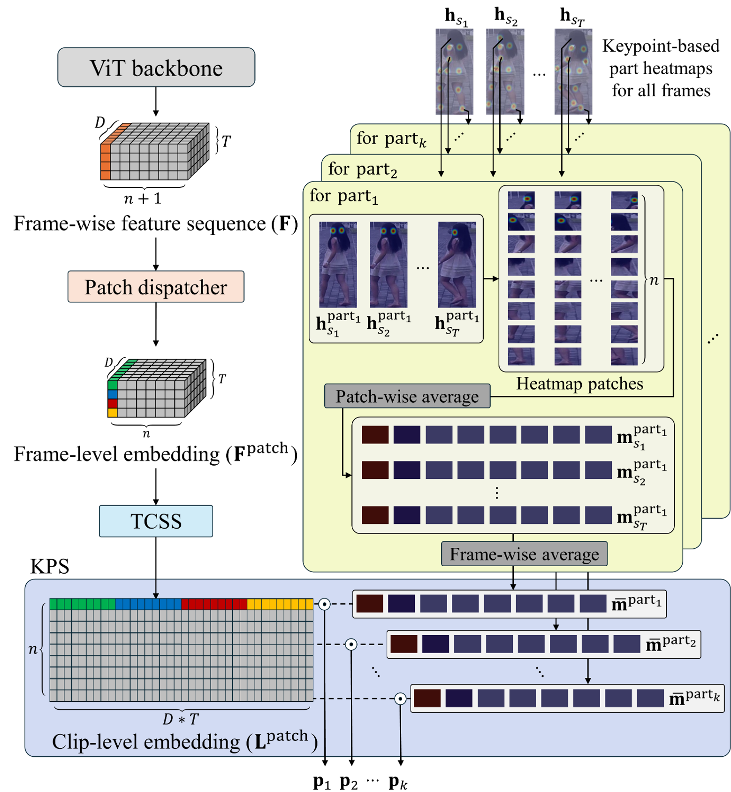

# KeyRe-ID

**KeyRe-ID** is a keypoint-guided video-based person re-identification (Re-ID) framework consisting of global and local branches that leverage human pose information for enhanced spatiotemporal feature learning. By dynamically aligning semantic body parts with patch tokens, our model achieves robust identity discrimination under challenging conditions such as occlusion, pose variation, and viewpoint change.


## Overview

KeyRe-ID introduces a dual-branch architecture that jointly learns:

- **Global clip-level representations** using temporal attention over [CLS] tokens
- **Part-aware local features** guided by human keypoints and structured via the Keypoint-guided Part Segmentation (KPS) module

This joint learning strategy enables the model to capture both holistic identity semantics and fine-grained anatomical details.

---

## Architecture

KeyRe-ID is composed of four core modules:

- **ViT Backbone**  
  Extracts patch and [CLS] tokens from each frame using a Vision Transformer.

- **Global Branch**  
  Aggregates [CLS] tokens across sampled frames via temporal attention to form a clip-level identity feature.

- **Local Branch**  
  Utilizes pose keypoints (via PifPaf) to generate part-specific heatmaps. These guide patch-level attention via the **Keypoint-guided Part Segmentation (KPS)** module.

- **Temporal Clip Shift and Shuffle (TCSS)**  
  Perturbs patch token order across frames to improve robustness under motion variation and temporal misalignment.

<p align="center">
  
</p>


## KPS Visualization

<p align="center">
  
</p>

The KPS module transforms keypoint-derived heatmaps into patch-level part importance vectors. These are used to modulate patch token attention per body part, enabling fine-grained part-aware representation learning.

---

## 🔎 Retrieval Comparison

<p align="center">
  
</p>

**Left**: Top-10 retrieval results from **VID-Trans-ReID**  
**Right**: Top-10 retrieval results from **KeyRe-ID (Ours)**  
🟩 Green boxes indicate correct identity matches  
🟥 Red boxes indicate incorrect matches

This visual comparison illustrates that **KeyRe-ID** retrieves more accurate identity matches than VID-Trans-ReID, especially under pose variation, viewpoint change, and occlusion.


## 🏆 Performance

KeyRe-ID outperforms prior methods on two standard video-based Re-ID benchmarks.

### 📊 MARS

| Metric     | Value (%) |
|------------|-----------|
| mAP        | 91.73     |
| Rank-1     | 97.32     |

### 📊 iLIDS-VID

| Metric     | Value (%) |
|------------|-----------|
| Rank-1     | 96.00     |
| Rank-5     | 100.00    |


---

## 🏁 Getting Started

Download the ImageNet pretrained transformer model:  
- [ViT_base](https://huggingface.co/google/vit-base-patch16-224)

Download the video person Re-ID datasets:  
- [MARS](http://www.liangzheng.com.cn/Project/project_mars.html)  
- [iLIDS-VID](https://xiatian-zhu.github.io/downloads_qmul_iLIDS-VID_ReID_dataset.html)


## ⚙️ Installation

```bash
git clone https://github.com/JinSeong0115/KeyRe-ID.git
cd KeyRe-ID
pip install -r requirements.txt
```


## 🚀 Usage

### Training and Evaluation
To train or evaluate the model on supported Video-based Re-ID benchmarks (e.g., MARS, iLIDS-VID):
```bash
python Key_ReID.py --Dataset_name 'Dataset_name' --ViT_path 'pretrained_model.pth'
```
Example for MARS dataset:
```bash
python Key_ReID.py --Dataset_name 'Mars' --ViT_path 'path_to_pretrained_model.pth'
```

---

## ✨ Key Features Summary

✔️ Dual-branch framework: global + part-aware representation  
✔️ Keypoint-guided Part Segmentation (KPS) for semantic part alignment  
✔️ TCSS module for temporal perturbation robustness  
✔️ Transformer-based temporal attention for long-range dependency modeling  
✔️ Optimized for video-based person Re-ID benchmarks under occlusion, pose variation, and illumination changes  


## 🙏 Acknowledgement
- Thanks to AishahAADU, using some implementation from [AishahAADU's repository](https://github.com/AishahAADU/VID-Trans-ReID)  


